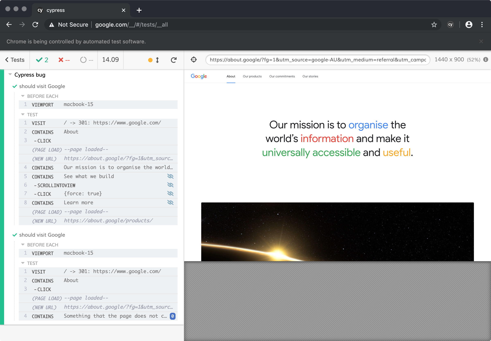
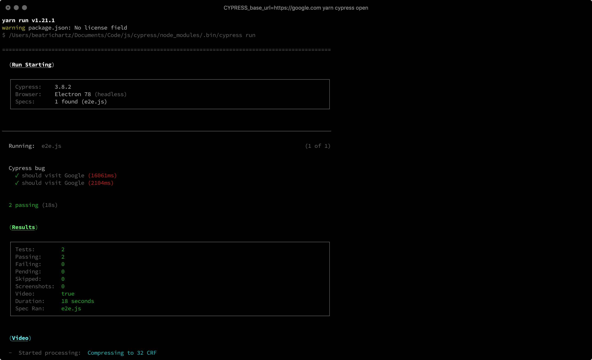
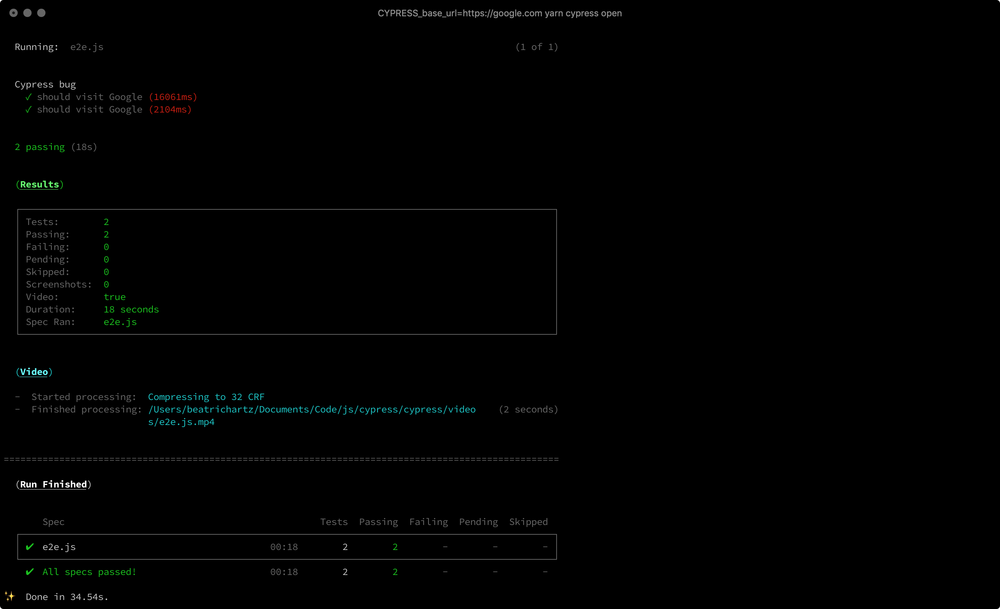

# Configuration

## Versions
* Chrome: 78.0.3904.87
* OS (`uname -a`): Darwin br.local 18.7.0 Darwin Kernel Version 18.7.0: Tue Aug 20 16:57:14 PDT 2019; root:xnu-4903.271.2~2/RELEASE_X86_64 x86_64
* Cypress: 3.8.2
* Node: v12.13.1
* Yarn: v1.21.1

## Output

### `CYPRESS_base_url=https://google.com yarn cypress open`

[Log output](./osx-cypress-3.8.2-chrome-78/cypress-open-output.log)

### `CYPRESS_base_url=https://google.com yarn cypress run`

